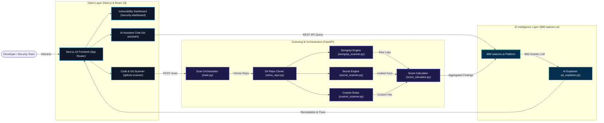

# SecureBob AI — Enterprise Code Security Suite

SecureBob AI is a production-grade, next-generation code security analysis suite. It combines automated static application security testing (SAST), regex-based secret scanners, and enterprise-grade AI-powered explanations to help developers find, prioritize, and remediate security issues earlier in the software development lifecycle (SDLC).

Leveraging IBM watsonx.ai and IBM Granite foundation models for code, SecureBob AI provides developer-centric explanations and refactored secure code suggestions directly alongside raw scanner findings.

---

## Technical Capabilities

SecureBob AI orchestrates six integrated capabilities designed to secure modern codebases:

1. **GitHub Repository Scanner**: Programmatic cloning and auditing of public or private git repositories using GitPython, providing comprehensive vulnerability detection across branches.
2. **Vulnerability Detection (SAST)**: Automated rulesets detecting SQL injection, Cross-Site Scripting (XSS), insecure deserialization, and other OWASP Top 10 vulnerabilities.
3. **Secret Leak Detection**: Static scanning engines mapping exposed high-entropy secrets including API keys, JWT tokens, AWS credentials, and database connection strings.
4. **Pull Request Security Review**: Staged code checking that intercepts code diffs in Pull Requests and identifies newly introduced security liabilities before they merge.
5. **Security Score Dashboard**: Aggregate threat severity weighing that computes a unified, real-time security posture score, listing severity counts and historical risk curves.
6. **AI Security Assistant**: Conversational agent powered by IBM Granite models providing immediate secure coding recommendations, custom refactoring, and educational walk-throughs.

---

## Technical Stack

* **Frontend**: Next.js 16 (App Router), React 19, TypeScript
* **Styling**: Tailwind CSS v4, Radix UI primitive systems (shadcn/ui), Lucide icons
* **Animations**: Framer Motion for hardware-accelerated micro-animations and smooth page transitions
* **Backend**: Python 3.10+, FastAPI, Pydantic, GitPython
* **Scanning Engine**: Custom regex profile scanners and Semgrep CLI rulesets
* **AI Core Orchestrator**: IBM watsonx.ai platform and IBM Granite code foundation models
* **Package Management**: pnpm (fast, deterministic node package manager)

---

## System Architecture

The architecture decouples the highly responsive Next.js frontend from the high-throughput Python FastAPI scanning service, delegating model execution to IBM watsonx.ai:



---

## Scanning Engine & Backend Services

The core analytical capabilities reside within `backend/scanners/`, driven by a lightweight FastAPI server:

* **Semgrep Scanner (`semgrep_scanner.py`)**: Runs local Semgrep rulesets targeting target directories. Focuses on insecure coding patterns, framework-specific misconfigurations, and standard security bugs.
* **Secret Scanner (`secret_scanner.py`)**: Executes scanning targeting keys and access tokens. Runs high-entropy character analysis coupled with precise pattern-matching regex profiles.
* **Custom Scanner (`custom_scanner.py`)**: Implements rule-based lexical matching for common insecure APIs, custom team guidelines, and quick-check rules.
* **Score Calculator (`score_calculator.py`)**: Scores finding counts, severities (Critical, High, Medium, Low), and computes a consolidated Security Dashboard Score (out of 100).
* **AI Explainer (`ai_explainer.py`)**: Bridges the raw JSON findings with the IBM watsonx.ai Granite models to yield remediation descriptions, insecure vs. secure code comparisons, and threat descriptions.
* **PR Review Scanner (`pr_review_scanner.py`)**: Performs automated reviews on direct code diff strings, returning inline security assessments.

---

## Project Directory Layout

```filepath
secure-bob-ai-app/
├── app/                        # Next.js 16 App Router Pages
│   ├── ai-assistant/           # AI Security Assistant Interface
│   ├── features/               # Security Features Showcase
│   ├── github-scanner/         # GitHub Repository Scanner Dashboard
│   ├── pr-review/              # PR Diff Review Interface
│   ├── secret-scanner/         # Secret and Credential Leaks UI
│   ├── security-dashboard/     # Unified Posture Dashboard and Analytics
│   ├── vulnerability-scanner/  # SAST Insecure Code Scanning UI
│   ├── globals.css             # Tailwind v4 Global Custom Styles
│   ├── layout.tsx              # Base Shell and Theme Provider
│   └── page.tsx                # Cyber-inspired Platform Landing Page
├── backend/                    # Python FastAPI Scanning Backend
│   ├── github/                 # Repository cloning modules
│   │   └── clone_repo.py
│   ├── scanners/               # Automated Static & AI Explainer Engines
│   │   ├── ai_explainer.py
│   │   ├── custom_scanner.py
│   │   ├── pr_review_scanner.py
│   │   ├── score_calculator.py
│   │   ├── secret_scanner.py
│   │   └── semgrep_scanner.py
│   ├── main.py                 # FastAPI Web Server Entrypoint
│   └── requirements.txt        # Backend dependencies
├── components/                 # Shared React Components
│   ├── ui/                     # Base Radix primitives (Button, Card, Dialog, Toast)
│   ├── cyber-background.tsx    # Immersive glowing network grid canvas
│   ├── terminal-animation.tsx  # Immersive retro terminal scanner simulator
│   ├── navbar.tsx              # Universal Navigation Header
│   └── footer.tsx              # Dashboard Footer
├── docs/                       # Architectural docs & diagrams
│   └── ARCHITECTURE.md
├── public/                     # Static assets and scanner screenshots
├── package.json                # Frontend package configurations
└── pnpm-lock.yaml              # pnpm locked dependencies
```

---

## Local Development Setup

To run the full SecureBob AI suite locally, start both the Python FastAPI server and the Next.js development server.

### Backend Setup (Python)

1. **Navigate to the Backend Directory**:
   ```bash
   cd backend
   ```

2. **Initialize Virtual Environment**:
   ```bash
   python -m venv .venv
   ```

3. **Activate the Virtual Environment**:
   * Windows:
     ```powershell
     .venv\Scripts\activate
     ```
   * macOS/Linux:
     ```bash
     source .venv/bin/activate
     ```

4. **Install Dependencies**:
   ```bash
   pip install -r requirements.txt
   ```

5. **Start the FastAPI Server**:
   ```bash
   uvicorn main:app --reload --host 127.0.0.1 --port 8000
   ```
   The backend API documentation is available at `http://127.0.0.1:8000/docs`.

---

### Frontend Setup (Next.js)

1. **Return to the Project Root**:
   ```bash
   cd ..
   ```

2. **Install Node.js Dependencies**:
   ```bash
   pnpm install
   ```

3. **Configure Environment Variables**:
   Create a `.env.local` file at the root of the project:
   ```env
   NEXT_PUBLIC_API_URL=http://127.0.0.1:8000
   ```

4. **Start the Development Server**:
   ```bash
   pnpm dev
   ```
   Open **`http://localhost:3000`** in your browser to view the application.

---

## Design System & Aesthetics

SecureBob AI utilizes a carefully curated developer aesthetic designed to look premium, modern, and high-tech:
* **Interactive Glowing Canvas**: Custom background animation simulating data streaming and node layouts.
* **Refined Dark Mode**: Monochromatic obsidian backdrop colors accented with neon cyber-blue, indigo, emerald, and amber alerts.
* **Micro-Animations**: Framer Motion orchestrations providing smooth slide-ins, element expansions, and interactive hover feedbacks.
* **Responsive Layout Grid**: High-fidelity CSS Grid and Flexbox layouts optimized to preserve presentation across diverse viewport resolutions.

---

## Hackathon Team

This project was built for the IBM watsonx.ai & Granite matchup:
* **Vidyankshini Vibhute** — Frontend Developer (React, Next.js, and premium UI/UX Specialist)
* **Satyam Kulkarni** —  Backend & AI Developer (Python FastAPI and IBM watsonx.ai integration)
* **Siya Kale** — Security Research Lead (Cybersecurity rulesets and threat model mapping)

---

## License

This project is licensed under the **MIT License**. For details, see the LICENSE file.

---

**SecureBob AI** — *Scan Before You Push!*
