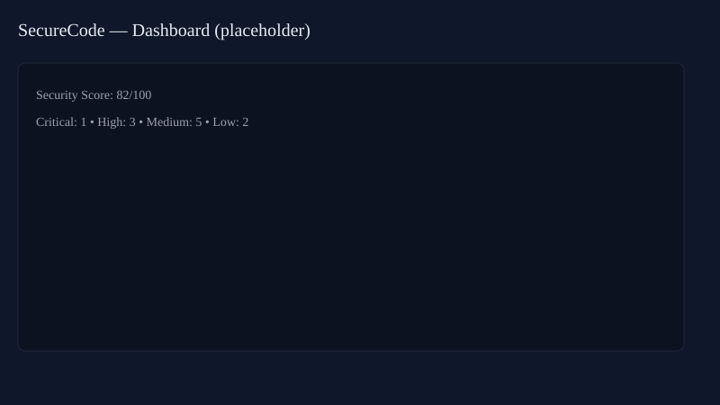
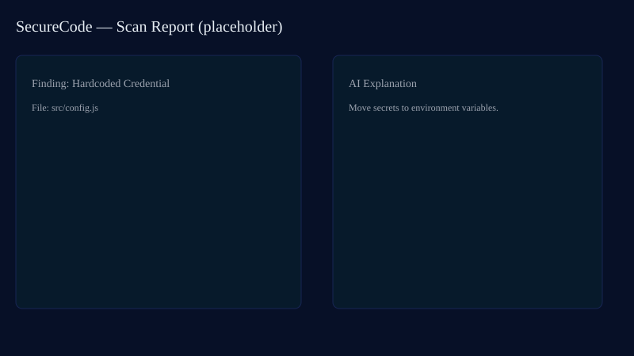

# SecureCode — Secure Bob AI App

SecureCode is an integrated code security analysis suite that combines automated scanners and AI-powered explanations to help developers find, prioritize, and remediate security issues earlier in the development lifecycle.

## Problem

Modern development workflows move fast. Security tools are often fragmented, produce noisy findings, and leave developers unsure how to fix issues. This results in delayed remediation and higher risk in production.

## Solution

SecureCode provides a unified web interface and backend scanners that analyze repositories for vulnerabilities, secrets, and risky code patterns, and uses AI to explain findings in actionable language. The app bundles multiple scanning strategies and prioritizes results so teams can act quickly.

## Features

- Multi-scanner support: secret detection, static analyzers, custom scanners, and PR review helpers.
- AI explanations: natural-language descriptions and remediation suggestions for findings.
- Prioritization and scoring: aggregate risk scores to focus on critical issues first.
- Repository cloning and on-demand scanning for PRs or full repo audits.
- Lightweight dashboard and per-scan report export.

## Tech Stack

- Frontend: Next.js, React, TypeScript
- Backend: Python (scripts in `backend/`) for scanners and scoring
- Scanners: semgrep, custom Python scanners, secret detection logic
- Dev tooling: pnpm (frontend), virtualenv or venv for Python

## System architecture

High level:

- The Next.js frontend delivers the UI and calls backend APIs for scan requests and results.
- A Python backend orchestrates repository cloning, runs scanner modules under `backend/scanners/`, and computes scores.
- Scans are persisted temporarily to `temp_repo/` and results are returned to the frontend for display and AI explanation.

Architecture diagram (generated):


High-level flow:

```
[Browser] -> [Next.js Frontend] -> [API] -> [Python Backend]
                                     |
                                     -> [Repo Cloner] -> [Scanners: semgrep, secret_scanner, custom_scanner]
                                     -> [Score Calculator] -> [Results / AI Explainer]
```

## Setup

Prerequisites:

- Node.js (16+), pnpm
- Python 3.10+ and virtualenv (or venv)
- Optional: semgrep installed if you plan to use it locally

Quick start (development):

1. Clone the repository

```bash
git clone <repo-url>
cd SecureCode
```

2. Frontend: install and run

```bash
pnpm install
pnpm dev
```

3. Backend: create a virtual environment and run the backend scanner service

```bash
python -m venv .venv
source .venv/Scripts/activate    # Windows: .venv\\Scripts\\activate
pip install -r backend/requirements.txt || pip install -r requirements.txt
python backend/main.py
```

- Notes:

- A generated `backend/requirements.txt` is included with the core backend dependencies used by the project (FastAPI, Pydantic, GitPython, semgrep, uvicorn).
- If you need additional AI SDKs (e.g., OpenAI or IBM SDKs) for cloud integrations, tell me and I will add them to `requirements.txt`.
- The frontend runs on `http://localhost:3000` by default and will call the backend API endpoints.

## Usage

- Open the app in your browser at `http://localhost:3000`.
- Use the repository scanner UI to provide a GitHub URL or upload a repository snapshot.
- Start a scan, review findings in the dashboard, and click into items for AI-powered explanations and suggested fixes.

## Screenshots

Add screenshots to `public/screenshots/` and embed them here. Example:

```markdown


```

The repository contains placeholder images at `public/screenshots/` to help you replace them with real captures.

## Deployment

Docker (backend):

1. Build the backend image from the project root:

```bash
docker build -t securecode-backend -f backend/Dockerfile .
```

2. Run the backend (example):

```bash
docker run -p 8000:8000 securecode-backend
```

The FastAPI app can then be served with `uvicorn backend.main:app --host 0.0.0.0 --port 8000` inside the container.

Vercel (frontend):

- Push the frontend to a Git provider (GitHub/GitLab). Connect the repo to Vercel and set environment variables as needed. The Next.js app will be deployed automatically; configure the API_BASE_URL to point to your backend instance.

If you want, I can generate a `backend/Dockerfile` and a `Docker Compose` example next.

## Demo

- Live demo: (optional) add a hosted URL here when available.
- Local demo: run frontend and backend as above and scan a small public repo to see results.

## Team

- Maintainers: add your names and contact info here.
- Contributions: please open pull requests and describe changes clearly.

## License

This project is provided under the MIT License — update this section to match your preferred license and include a `LICENSE` file.

---

