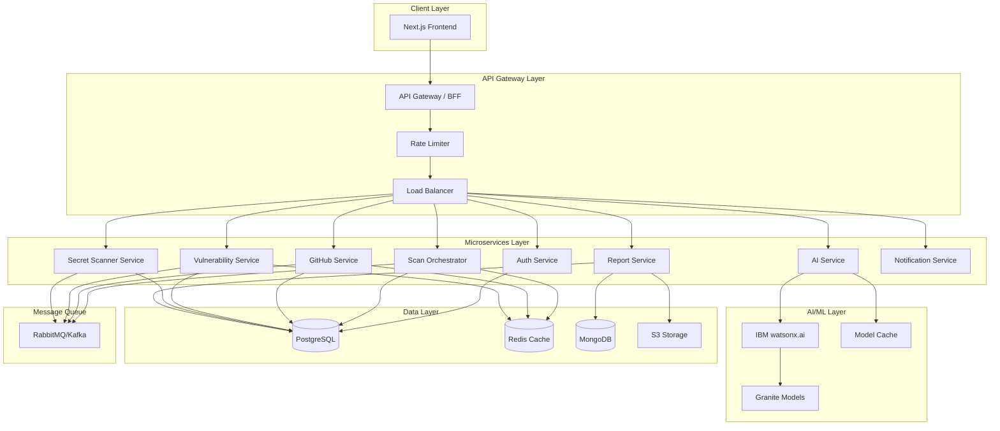
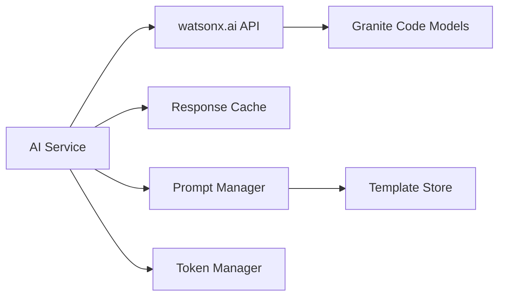
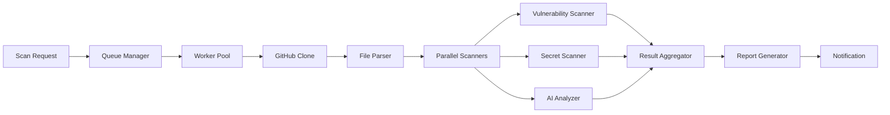

# SecureCode AI - Scalable Backend Architecture

## Executive Summary

SecureCode AI is an AI-powered GitHub vulnerability scanner built on Next.js frontend with a microservices-based backend architecture. This document outlines a production-ready, scalable architecture focusing on backend services, API design, database schema, and IBM watsonx.ai integration.

## Current State Analysis

### Existing Structure
- **Frontend**: Next.js 16.2.6 with App Router
- **UI Components**: Comprehensive shadcn/ui component library
- **Features**: 6 main features (GitHub Scanner, Vulnerability Scanner, Secret Scanner, PR Review, Security Dashboard, AI Assistant)
- **Backend**: Currently missing - needs complete implementation
- **State**: Frontend-only with mock data

### Identified Gaps
1. No backend API infrastructure
2. No database layer
3. No IBM watsonx.ai integration
4. No authentication/authorization system
5. No real-time scanning pipeline
6. No data persistence layer
7. No queue management for async operations

---

## Architecture Overview

### High-Level Architecture



---

## Microservices Architecture

### 1. API Gateway / BFF (Backend for Frontend)

**Technology**: Node.js + Express / Next.js API Routes
**Purpose**: Single entry point, request routing, authentication

**Responsibilities**:
- Request routing to appropriate microservices
- Authentication token validation
- Rate limiting and throttling
- Request/response transformation
- API versioning
- CORS handling

**Endpoints**:
```
/api/v1/auth/*
/api/v1/scan/*
/api/v1/github/*
/api/v1/vulnerabilities/*
/api/v1/secrets/*
/api/v1/reports/*
/api/v1/dashboard/*
```

---

### 2. Authentication Service

**Technology**: Node.js + Express + Passport.js
**Database**: PostgreSQL
**Cache**: Redis

**Responsibilities**:
- User registration and login
- JWT token generation and validation
- OAuth integration (GitHub, Google)
- API key management
- Role-based access control (RBAC)
- Session management

**Database Schema**:
```sql
-- Users table
CREATE TABLE users (
    id UUID PRIMARY KEY DEFAULT gen_random_uuid(),
    email VARCHAR(255) UNIQUE NOT NULL,
    password_hash VARCHAR(255),
    github_id VARCHAR(255) UNIQUE,
    google_id VARCHAR(255) UNIQUE,
    role VARCHAR(50) DEFAULT 'user',
    is_active BOOLEAN DEFAULT true,
    created_at TIMESTAMP DEFAULT NOW(),
    updated_at TIMESTAMP DEFAULT NOW()
);

-- API Keys table
CREATE TABLE api_keys (
    id UUID PRIMARY KEY DEFAULT gen_random_uuid(),
    user_id UUID REFERENCES users(id) ON DELETE CASCADE,
    key_hash VARCHAR(255) NOT NULL,
    name VARCHAR(255),
    scopes JSONB,
    last_used_at TIMESTAMP,
    expires_at TIMESTAMP,
    created_at TIMESTAMP DEFAULT NOW()
);

-- Sessions table
CREATE TABLE sessions (
    id UUID PRIMARY KEY DEFAULT gen_random_uuid(),
    user_id UUID REFERENCES users(id) ON DELETE CASCADE,
    token_hash VARCHAR(255) NOT NULL,
    ip_address INET,
    user_agent TEXT,
    expires_at TIMESTAMP NOT NULL,
    created_at TIMESTAMP DEFAULT NOW()
);
```

**API Endpoints**:
```
POST   /api/v1/auth/register
POST   /api/v1/auth/login
POST   /api/v1/auth/logout
POST   /api/v1/auth/refresh
GET    /api/v1/auth/me
POST   /api/v1/auth/github/callback
POST   /api/v1/auth/google/callback
POST   /api/v1/auth/api-keys
GET    /api/v1/auth/api-keys
DELETE /api/v1/auth/api-keys/:id
```

---

### 3. Scan Orchestrator Service

**Technology**: Node.js + Express
**Database**: PostgreSQL
**Queue**: RabbitMQ/Kafka
**Cache**: Redis

**Responsibilities**:
- Coordinate multi-step scanning workflows
- Manage scan lifecycle (queued, running, completed, failed)
- Distribute work to specialized scanners
- Aggregate results from multiple services
- Handle scan prioritization
- Manage concurrent scan limits

**Database Schema**:
```sql
-- Scans table
CREATE TABLE scans (
    id UUID PRIMARY KEY DEFAULT gen_random_uuid(),
    user_id UUID REFERENCES users(id) ON DELETE CASCADE,
    repository_url VARCHAR(500) NOT NULL,
    repository_name VARCHAR(255),
    branch VARCHAR(255) DEFAULT 'main',
    scan_type VARCHAR(50) NOT NULL, -- 'full', 'quick', 'pr', 'incremental'
    status VARCHAR(50) DEFAULT 'queued', -- 'queued', 'running', 'completed', 'failed', 'cancelled'
    priority INTEGER DEFAULT 5,
    progress INTEGER DEFAULT 0,
    total_files INTEGER,
    scanned_files INTEGER DEFAULT 0,
    started_at TIMESTAMP,
    completed_at TIMESTAMP,
    error_message TEXT,
    metadata JSONB,
    created_at TIMESTAMP DEFAULT NOW(),
    updated_at TIMESTAMP DEFAULT NOW()
);

-- Scan results summary
CREATE TABLE scan_results (
    id UUID PRIMARY KEY DEFAULT gen_random_uuid(),
    scan_id UUID REFERENCES scans(id) ON DELETE CASCADE,
    critical_count INTEGER DEFAULT 0,
    high_count INTEGER DEFAULT 0,
    medium_count INTEGER DEFAULT 0,
    low_count INTEGER DEFAULT 0,
    info_count INTEGER DEFAULT 0,
    vulnerabilities_found INTEGER DEFAULT 0,
    secrets_found INTEGER DEFAULT 0,
    security_score DECIMAL(5,2),
    created_at TIMESTAMP DEFAULT NOW()
);

-- Scan queue
CREATE TABLE scan_queue (
    id UUID PRIMARY KEY DEFAULT gen_random_uuid(),
    scan_id UUID REFERENCES scans(id) ON DELETE CASCADE,
    priority INTEGER DEFAULT 5,
    retry_count INTEGER DEFAULT 0,
    max_retries INTEGER DEFAULT 3,
    scheduled_at TIMESTAMP DEFAULT NOW(),
    created_at TIMESTAMP DEFAULT NOW()
);
```

**API Endpoints**:
```
POST   /api/v1/scan/start
GET    /api/v1/scan/:id
GET    /api/v1/scan/:id/status
POST   /api/v1/scan/:id/cancel
GET    /api/v1/scan/user/:userId
DELETE /api/v1/scan/:id
POST   /api/v1/scan/:id/retry
```

---

### 4. GitHub Service

**Technology**: Python + FastAPI
**Database**: PostgreSQL
**Cache**: Redis
**External API**: GitHub REST API, GitHub GraphQL API

**Responsibilities**:
- GitHub authentication and OAuth
- Repository cloning and access
- Fetch repository metadata
- Pull request analysis
- Commit history analysis
- Branch management
- Webhook handling for real-time updates

**Database Schema**:
```sql
-- GitHub repositories
CREATE TABLE github_repositories (
    id UUID PRIMARY KEY DEFAULT gen_random_uuid(),
    user_id UUID REFERENCES users(id) ON DELETE CASCADE,
    github_repo_id BIGINT UNIQUE NOT NULL,
    owner VARCHAR(255) NOT NULL,
    name VARCHAR(255) NOT NULL,
    full_name VARCHAR(500) NOT NULL,
    private BOOLEAN DEFAULT false,
    default_branch VARCHAR(255),
    language VARCHAR(100),
    stars INTEGER DEFAULT 0,
    forks INTEGER DEFAULT 0,
    last_scan_at TIMESTAMP,
    webhook_id BIGINT,
    is_active BOOLEAN DEFAULT true,
    metadata JSONB,
    created_at TIMESTAMP DEFAULT NOW(),
    updated_at TIMESTAMP DEFAULT NOW()
);

-- GitHub webhooks
CREATE TABLE github_webhooks (
    id UUID PRIMARY KEY DEFAULT gen_random_uuid(),
    repository_id UUID REFERENCES github_repositories(id) ON DELETE CASCADE,
    webhook_id BIGINT NOT NULL,
    events TEXT[] NOT NULL,
    secret VARCHAR(255),
    is_active BOOLEAN DEFAULT true,
    created_at TIMESTAMP DEFAULT NOW()
);

-- Pull requests
CREATE TABLE pull_requests (
    id UUID PRIMARY KEY DEFAULT gen_random_uuid(),
    repository_id UUID REFERENCES github_repositories(id) ON DELETE CASCADE,
    pr_number INTEGER NOT NULL,
    title VARCHAR(500),
    author VARCHAR(255),
    base_branch VARCHAR(255),
    head_branch VARCHAR(255),
    status VARCHAR(50), -- 'open', 'closed', 'merged'
    scan_id UUID REFERENCES scans(id),
    created_at TIMESTAMP DEFAULT NOW(),
    updated_at TIMESTAMP DEFAULT NOW()
);
```

**API Endpoints**:
```
POST   /api/v1/github/connect
GET    /api/v1/github/repositories
GET    /api/v1/github/repositories/:id
POST   /api/v1/github/repositories/:id/scan
GET    /api/v1/github/repositories/:id/branches
GET    /api/v1/github/repositories/:id/pull-requests
POST   /api/v1/github/webhook
DELETE /api/v1/github/repositories/:id
```

---

### 5. Vulnerability Detection Service

**Technology**: Python + FastAPI
**Database**: PostgreSQL + MongoDB (for vulnerability patterns)
**AI Integration**: IBM watsonx.ai

**Responsibilities**:
- Static code analysis
- OWASP Top 10 detection
- SQL injection detection
- XSS vulnerability detection
- CSRF detection
- Insecure deserialization
- Security misconfiguration detection
- Custom vulnerability pattern matching

**Database Schema**:
```sql
-- Vulnerabilities
CREATE TABLE vulnerabilities (
    id UUID PRIMARY KEY DEFAULT gen_random_uuid(),
    scan_id UUID REFERENCES scans(id) ON DELETE CASCADE,
    type VARCHAR(100) NOT NULL, -- 'sql_injection', 'xss', 'csrf', etc.
    severity VARCHAR(50) NOT NULL, -- 'critical', 'high', 'medium', 'low', 'info'
    file_path VARCHAR(1000) NOT NULL,
    line_number INTEGER,
    column_number INTEGER,
    code_snippet TEXT,
    description TEXT NOT NULL,
    recommendation TEXT,
    cwe_id VARCHAR(50), -- CWE identifier
    owasp_category VARCHAR(100), -- OWASP Top 10 category
    confidence DECIMAL(5,2), -- AI confidence score
    false_positive BOOLEAN DEFAULT false,
    status VARCHAR(50) DEFAULT 'open', -- 'open', 'fixed', 'ignored', 'false_positive'
    metadata JSONB,
    created_at TIMESTAMP DEFAULT NOW(),
    updated_at TIMESTAMP DEFAULT NOW()
);

-- Vulnerability patterns (MongoDB)
{
    "_id": ObjectId,
    "pattern_id": "sql_injection_001",
    "name": "SQL Injection - String Concatenation",
    "type": "sql_injection",
    "severity": "critical",
    "regex_patterns": ["SELECT.*FROM.*WHERE.*\\$\\{.*\\}"],
    "languages": ["javascript", "typescript", "python"],
    "description": "Direct string concatenation in SQL queries",
    "recommendation": "Use parameterized queries or ORM",
    "cwe_id": "CWE-89",
    "owasp_category": "A03:2021-Injection",
    "enabled": true,
    "created_at": ISODate,
    "updated_at": ISODate
}
```

**API Endpoints**:
```
POST   /api/v1/vulnerabilities/scan
GET    /api/v1/vulnerabilities/scan/:scanId
GET    /api/v1/vulnerabilities/:id
PATCH  /api/v1/vulnerabilities/:id/status
GET    /api/v1/vulnerabilities/patterns
POST   /api/v1/vulnerabilities/patterns
```

---

### 6. Secret Scanner Service

**Technology**: Python + FastAPI
**Database**: PostgreSQL
**Pattern Matching**: Regex + Entropy Analysis

**Responsibilities**:
- API key detection
- Password detection
- JWT token detection
- AWS credentials detection
- Private key detection
- Database connection string detection
- OAuth token detection
- Entropy-based secret detection

**Database Schema**:
```sql
-- Secrets
CREATE TABLE secrets (
    id UUID PRIMARY KEY DEFAULT gen_random_uuid(),
    scan_id UUID REFERENCES scans(id) ON DELETE CASCADE,
    type VARCHAR(100) NOT NULL, -- 'api_key', 'password', 'jwt', 'aws_key', etc.
    severity VARCHAR(50) NOT NULL,
    file_path VARCHAR(1000) NOT NULL,
    line_number INTEGER,
    secret_hash VARCHAR(255), -- Hashed version for deduplication
    context TEXT, -- Surrounding code context
    description TEXT NOT NULL,
    recommendation TEXT,
    entropy_score DECIMAL(5,2),
    is_verified BOOLEAN DEFAULT false, -- Whether secret is still valid
    status VARCHAR(50) DEFAULT 'active', -- 'active', 'revoked', 'false_positive'
    metadata JSONB,
    created_at TIMESTAMP DEFAULT NOW(),
    updated_at TIMESTAMP DEFAULT NOW()
);

-- Secret patterns
CREATE TABLE secret_patterns (
    id UUID PRIMARY KEY DEFAULT gen_random_uuid(),
    name VARCHAR(255) NOT NULL,
    type VARCHAR(100) NOT NULL,
    regex_pattern TEXT NOT NULL,
    entropy_threshold DECIMAL(5,2),
    severity VARCHAR(50) NOT NULL,
    description TEXT,
    is_active BOOLEAN DEFAULT true,
    created_at TIMESTAMP DEFAULT NOW()
);
```

**API Endpoints**:
```
POST   /api/v1/secrets/scan
GET    /api/v1/secrets/scan/:scanId
GET    /api/v1/secrets/:id
PATCH  /api/v1/secrets/:id/revoke
GET    /api/v1/secrets/patterns
POST   /api/v1/secrets/verify/:id
```

---

### 7. AI Service (IBM watsonx.ai Integration)

**Technology**: Python + FastAPI
**AI Platform**: IBM watsonx.ai
**Models**: IBM Granite Code Models
**Cache**: Redis

**Responsibilities**:
- Interface with IBM watsonx.ai API
- Manage Granite model inference
- Code analysis using AI
- Vulnerability explanation generation
- Fix recommendation generation
- Code quality assessment
- Model response caching
- Prompt engineering and optimization

**Integration Architecture**:
```python
# IBM watsonx.ai Configuration
WATSONX_CONFIG = {
    "api_key": os.getenv("WATSONX_API_KEY"),
    "project_id": os.getenv("WATSONX_PROJECT_ID"),
    "url": "https://us-south.ml.cloud.ibm.com",
    "models": {
        "code_analysis": "ibm/granite-20b-code-instruct",
        "vulnerability_detection": "ibm/granite-34b-code-instruct",
        "fix_generation": "ibm/granite-20b-code-instruct"
    }
}
```

**Database Schema**:
```sql
-- AI analysis results
CREATE TABLE ai_analyses (
    id UUID PRIMARY KEY DEFAULT gen_random_uuid(),
    scan_id UUID REFERENCES scans(id) ON DELETE CASCADE,
    model_name VARCHAR(255) NOT NULL,
    model_version VARCHAR(100),
    input_tokens INTEGER,
    output_tokens INTEGER,
    analysis_type VARCHAR(100), -- 'vulnerability', 'code_quality', 'fix_suggestion'
    confidence_score DECIMAL(5,2),
    result JSONB NOT NULL,
    processing_time_ms INTEGER,
    created_at TIMESTAMP DEFAULT NOW()
);

-- Model cache
CREATE TABLE model_cache (
    id UUID PRIMARY KEY DEFAULT gen_random_uuid(),
    cache_key VARCHAR(255) UNIQUE NOT NULL,
    model_name VARCHAR(255) NOT NULL,
    input_hash VARCHAR(255) NOT NULL,
    response JSONB NOT NULL,
    hit_count INTEGER DEFAULT 0,
    expires_at TIMESTAMP NOT NULL,
    created_at TIMESTAMP DEFAULT NOW()
);
```

**API Endpoints**:
```
POST   /api/v1/ai/analyze-code
POST   /api/v1/ai/detect-vulnerabilities
POST   /api/v1/ai/generate-fix
POST   /api/v1/ai/explain-vulnerability
GET    /api/v1/ai/models
GET    /api/v1/ai/usage-stats
```

**Prompt Templates**:
```python
VULNERABILITY_DETECTION_PROMPT = """
Analyze the following code for security vulnerabilities:

Language: {language}
Code:
```{code}```

Identify:
1. Security vulnerabilities (SQL injection, XSS, CSRF, etc.)
2. Severity level (critical, high, medium, low)
3. Exact line numbers
4. Detailed explanation
5. Recommended fixes

Format response as JSON.
"""

FIX_GENERATION_PROMPT = """
Generate a secure fix for the following vulnerability:

Vulnerability Type: {vulnerability_type}
Severity: {severity}
Current Code:
```{code}```

Provide:
1. Fixed code
2. Explanation of changes
3. Additional security recommendations
"""
```

---

### 8. Report Service

**Technology**: Node.js + Express
**Database**: PostgreSQL + MongoDB
**Storage**: AWS S3 / Azure Blob Storage
**PDF Generation**: Puppeteer

**Responsibilities**:
- Generate comprehensive scan reports
- PDF report generation
- JSON/CSV export
- Historical trend analysis
- Compliance reporting (OWASP, CWE, PCI-DSS)
- Report scheduling and automation
- Report sharing and permissions

**Database Schema**:
```sql
-- Reports
CREATE TABLE reports (
    id UUID PRIMARY KEY DEFAULT gen_random_uuid(),
    scan_id UUID REFERENCES scans(id) ON DELETE CASCADE,
    user_id UUID REFERENCES users(id) ON DELETE CASCADE,
    report_type VARCHAR(50) NOT NULL, -- 'full', 'summary', 'compliance', 'trend'
    format VARCHAR(20) NOT NULL, -- 'pdf', 'json', 'csv', 'html'
    file_url VARCHAR(1000),
    file_size_bytes BIGINT,
    status VARCHAR(50) DEFAULT 'generating', -- 'generating', 'completed', 'failed'
    metadata JSONB,
    created_at TIMESTAMP DEFAULT NOW(),
    expires_at TIMESTAMP
);

-- Report templates
CREATE TABLE report_templates (
    id UUID PRIMARY KEY DEFAULT gen_random_uuid(),
    name VARCHAR(255) NOT NULL,
    description TEXT,
    template_type VARCHAR(50),
    template_content JSONB,
    is_default BOOLEAN DEFAULT false,
    created_at TIMESTAMP DEFAULT NOW()
);
```

**API Endpoints**:
```
POST   /api/v1/reports/generate
GET    /api/v1/reports/:id
GET    /api/v1/reports/:id/download
GET    /api/v1/reports/scan/:scanId
DELETE /api/v1/reports/:id
GET    /api/v1/reports/templates
```

---

### 9. Notification Service

**Technology**: Node.js + Express
**Queue**: RabbitMQ
**Email**: SendGrid / AWS SES
**Webhooks**: Custom HTTP endpoints

**Responsibilities**:
- Email notifications
- Webhook notifications
- Slack/Discord integration
- Real-time WebSocket updates
- Notification preferences management
- Digest emails (daily/weekly summaries)

**Database Schema**:
```sql
-- Notifications
CREATE TABLE notifications (
    id UUID PRIMARY KEY DEFAULT gen_random_uuid(),
    user_id UUID REFERENCES users(id) ON DELETE CASCADE,
    type VARCHAR(100) NOT NULL, -- 'scan_complete', 'vulnerability_found', 'critical_alert'
    title VARCHAR(255) NOT NULL,
    message TEXT NOT NULL,
    severity VARCHAR(50),
    is_read BOOLEAN DEFAULT false,
    metadata JSONB,
    created_at TIMESTAMP DEFAULT NOW()
);

-- Notification preferences
CREATE TABLE notification_preferences (
    id UUID PRIMARY KEY DEFAULT gen_random_uuid(),
    user_id UUID REFERENCES users(id) ON DELETE CASCADE,
    email_enabled BOOLEAN DEFAULT true,
    webhook_enabled BOOLEAN DEFAULT false,
    slack_enabled BOOLEAN DEFAULT false,
    notification_types JSONB, -- Which types to receive
    webhook_url VARCHAR(1000),
    slack_webhook_url VARCHAR(1000),
    created_at TIMESTAMP DEFAULT NOW(),
    updated_at TIMESTAMP DEFAULT NOW()
);
```

**API Endpoints**:
```
GET    /api/v1/notifications
GET    /api/v1/notifications/:id
PATCH  /api/v1/notifications/:id/read
DELETE /api/v1/notifications/:id
GET    /api/v1/notifications/preferences
PATCH  /api/v1/notifications/preferences
POST   /api/v1/notifications/test
```

---

## Database Architecture

### Primary Database: PostgreSQL

**Why PostgreSQL?**
- ACID compliance for critical security data
- Strong relational data modeling
- JSON support for flexible metadata
- Excellent performance for complex queries
- Robust indexing capabilities

**Database Structure**:
```
securecode_db/
├── users (authentication data)
├── scans (scan metadata and status)
├── vulnerabilities (detected vulnerabilities)
├── secrets (detected secrets)
├── github_repositories (GitHub integration)
├── reports (generated reports)
├── notifications (user notifications)
└── audit_logs (security audit trail)
```

**Indexes**:
```sql
-- Performance indexes
CREATE INDEX idx_scans_user_id ON scans(user_id);
CREATE INDEX idx_scans_status ON scans(status);
CREATE INDEX idx_scans_created_at ON scans(created_at DESC);
CREATE INDEX idx_vulnerabilities_scan_id ON vulnerabilities(scan_id);
CREATE INDEX idx_vulnerabilities_severity ON vulnerabilities(severity);
CREATE INDEX idx_secrets_scan_id ON secrets(scan_id);
CREATE INDEX idx_github_repos_user_id ON github_repositories(user_id);

-- Full-text search indexes
CREATE INDEX idx_vulnerabilities_description_fts ON vulnerabilities 
    USING gin(to_tsvector('english', description));
```

---

### Cache Layer: Redis

**Use Cases**:
- Session storage
- API rate limiting
- Scan status caching
- AI model response caching
- Real-time scan progress
- Temporary data storage

**Redis Data Structures**:
```
# Session cache
session:{session_id} -> {user_data}
TTL: 24 hours

# Rate limiting
rate_limit:{user_id}:{endpoint} -> counter
TTL: 1 hour

# Scan status cache
scan:status:{scan_id} -> {status, progress}
TTL: 1 hour

# AI response cache
ai:cache:{input_hash} -> {response}
TTL: 7 days

# Real-time updates
scan:progress:{scan_id} -> {progress_data}
TTL: 2 hours
```

---

### Document Store: MongoDB

**Use Cases**:
- Vulnerability patterns (flexible schema)
- Scan raw results (large JSON documents)
- AI analysis logs
- Unstructured metadata

**Collections**:
```javascript
// vulnerability_patterns
{
    pattern_id: String,
    name: String,
    type: String,
    regex_patterns: [String],
    languages: [String],
    severity: String,
    metadata: Object
}

// scan_raw_results
{
    scan_id: UUID,
    repository: String,
    files_analyzed: [Object],
    raw_output: Object,
    timestamp: Date
}
```

---

### Object Storage: AWS S3 / Azure Blob

**Use Cases**:
- Generated PDF reports
- Cloned repository archives
- Large scan artifacts
- Backup data

**Bucket Structure**:
```
securecode-storage/
├── reports/
│   ├── {user_id}/
│   │   └── {scan_id}/
│   │       └── report.pdf
├── repositories/
│   └── {scan_id}/
│       └── repo.tar.gz
└── backups/
    └── {date}/
        └── database_backup.sql
```

---

## Message Queue Architecture

### Technology: RabbitMQ / Apache Kafka

**Why Message Queue?**
- Asynchronous processing
- Load distribution
- Fault tolerance
- Scalability
- Decoupling services

**Queue Structure**:

```
Exchanges:
├── scan.exchange (topic)
│   ├── scan.started
│   ├── scan.progress
│   ├── scan.completed
│   └── scan.failed
│
├── vulnerability.exchange (topic)
│   ├── vulnerability.detected
│   └── vulnerability.critical
│
├── notification.exchange (fanout)
│   ├── notification.email
│   ├── notification.webhook
│   └── notification.slack
│
└── ai.exchange (topic)
    ├── ai.analyze
    └── ai.generate_fix
```

**Message Flow Example**:
```
1. User initiates scan
2. API Gateway → scan.started → Scan Orchestrator
3. Scan Orchestrator → github.clone → GitHub Service
4. GitHub Service → vulnerability.scan → Vulnerability Service
5. Vulnerability Service → ai.analyze → AI Service
6. AI Service → vulnerability.detected → Report Service
7. Report Service → notification.email → Notification Service
```

---

## IBM watsonx.ai Integration

### Architecture



### Integration Components

**1. watsonx.ai Client**
```python
from ibm_watson_machine_learning import APIClient

class WatsonxClient:
    def __init__(self):
        self.credentials = {
            "url": os.getenv("WATSONX_URL"),
            "apikey": os.getenv("WATSONX_API_KEY")
        }
        self.client = APIClient(self.credentials)
        self.project_id = os.getenv("WATSONX_PROJECT_ID")
    
    async def analyze_code(self, code: str, language: str):
        model_id = "ibm/granite-34b-code-instruct"
        parameters = {
            "max_new_tokens": 2000,
            "temperature": 0.1,
            "top_p": 0.95
        }
        
        prompt = self.build_prompt(code, language)
        response = await self.client.deployments.generate(
            model_id=model_id,
            prompt=prompt,
            params=parameters
        )
        
        return self.parse_response(response)
```

**2. Model Selection Strategy**
```python
MODEL_SELECTION = {
    "quick_scan": "ibm/granite-20b-code-instruct",
    "deep_analysis": "ibm/granite-34b-code-instruct",
    "fix_generation": "ibm/granite-20b-code-instruct",
    "code_explanation": "ibm/granite-13b-code-instruct"
}
```

**3. Caching Strategy**
- Cache AI responses for identical code snippets
- TTL: 7 days for vulnerability detection
- TTL: 30 days for fix suggestions
- Cache key: hash(code + model + parameters)

**4. Rate Limiting**
- 100 requests per minute per user
- 1000 requests per hour per organization
- Burst allowance: 20 requests

**5. Error Handling**
```python
async def analyze_with_retry(code: str, max_retries: int = 3):
    for attempt in range(max_retries):
        try:
            return await watsonx_client.analyze_code(code)
        except RateLimitError:
            await asyncio.sleep(2 ** attempt)
        except ModelUnavailableError:
            # Fallback to smaller model
            return await fallback_analysis(code)
        except Exception as e:
            if attempt == max_retries - 1:
                raise
            await asyncio.sleep(1)
```

---

## API Design Principles

### RESTful API Standards

**1. Versioning**
```
/api/v1/resource
/api/v2/resource
```

**2. HTTP Methods**
- GET: Retrieve resources
- POST: Create resources
- PUT: Full update
- PATCH: Partial update
- DELETE: Remove resources

**3. Status Codes**
- 200: Success
- 201: Created
- 204: No Content
- 400: Bad Request
- 401: Unauthorized
- 403: Forbidden
- 404: Not Found
- 429: Too Many Requests
- 500: Internal Server Error
- 503: Service Unavailable

**4. Response Format**
```json
{
    "success": true,
    "data": {
        "id": "uuid",
        "attributes": {}
    },
    "meta": {
        "timestamp": "2026-05-16T12:00:00Z",
        "version": "v1"
    },
    "errors": []
}
```

**5. Pagination**
```
GET /api/v1/scans?page=1&limit=20&sort=-created_at
```

**6. Filtering**
```
GET /api/v1/vulnerabilities?severity=critical&status=open
```

**7. Rate Limiting Headers**
```
X-RateLimit-Limit: 100
X-RateLimit-Remaining: 95
X-RateLimit-Reset: 1621234567
```

---

## Real-Time Scanning Pipeline

### Pipeline Architecture



### Pipeline Stages

**Stage 1: Initialization**
- Validate repository URL
- Check user permissions
- Estimate scan time
- Queue scan job

**Stage 2: Repository Acquisition**
- Clone repository (shallow clone for speed)
- Extract file tree
- Filter relevant files (exclude node_modules, .git, etc.)
- Calculate total files to scan

**Stage 3: Parallel Scanning**
- Distribute files across worker pool
- Run vulnerability detection
- Run secret scanning
- Run AI analysis (batched)

**Stage 4: Result Aggregation**
- Collect results from all scanners
- Deduplicate findings
- Calculate severity scores
- Generate security score

**Stage 5: Post-Processing**
- Generate report
- Send notifications
- Update database
- Clean up temporary files

### Performance Optimization

**1. Parallel Processing**
```python
async def scan_files_parallel(files: List[str], max_workers: int = 10):
    semaphore = asyncio.Semaphore(max_workers)
    
    async def scan_with_limit(file_path: str):
        async with semaphore:
            return await scan_file(file_path)
    
    tasks = [scan_with_limit(f) for f in files]
    return await asyncio.gather(*tasks)
```

**2. Caching Strategy**
- Cache file hashes to skip unchanged files
- Cache AI responses for common patterns
- Cache repository metadata

**3. Resource Management**
- Limit concurrent scans per user
- Implement scan prioritization
- Auto-scale workers based on queue depth

---

## Security & Compliance

### Security Measures

**1. Authentication & Authorization**
- JWT tokens with short expiration (15 minutes)
- Refresh tokens (7 days)
- API key authentication for programmatic access
- Role-based access control (RBAC)

**2. Data Encryption**
- TLS 1.3 for all API communication
- Encryption at rest for sensitive data
- Encrypted database connections
- Secure secret storage (AWS Secrets Manager / HashiCorp Vault)

**3. Input Validation**
- Strict input sanitization
- SQL injection prevention (parameterized queries)
- XSS prevention (output encoding)
- CSRF protection

**4. Rate Limiting**
- Per-user rate limits
- Per-IP rate limits
- Adaptive rate limiting based on behavior

**5. Audit Logging**
```sql
CREATE TABLE audit_logs (
    id UUID PRIMARY KEY DEFAULT gen_random_uuid(),
    user_id UUID REFERENCES users(id),
    action VARCHAR(255) NOT NULL,
    resource_type VARCHAR(100),
    resource_id UUID,
    ip_address INET,
    user_agent TEXT,
    request_data JSONB,
    response_status INTEGER,
    created_at TIMESTAMP DEFAULT NOW()
);
```

### Compliance

**OWASP Top 10 Coverage**
- A01: Broken Access Control ✓
- A02: Cryptographic Failures ✓
- A03: Injection ✓
- A04: Insecure Design ✓
- A05: Security Misconfiguration ✓
- A06: Vulnerable Components ✓
- A07: Authentication Failures ✓
- A08: Software and Data Integrity ✓
- A09: Security Logging Failures ✓
- A10: Server-Side Request Forgery ✓

---

## Monitoring & Observability

### Metrics Collection

**1. Application Metrics**
- Request rate (requests/second)
- Response time (p50, p95, p99)
- Error rate
- Active scans
- Queue depth

**2. Business Metrics**
- Scans per day
- Vulnerabilities detected
- User growth
- API usage

**3. Infrastructure Metrics**
- CPU usage
- Memory usage
- Disk I/O
- Network throughput
- Database connections

### Logging Strategy

**Log Levels**:
- ERROR: Critical failures
- WARN: Potential issues
- INFO: Important events
- DEBUG: Detailed debugging

**Structured Logging**:
```json
{
    "timestamp": "2026-05-16T12:00:00Z",
    "level": "INFO",
    "service": "vulnerability-service",
    "trace_id": "abc123",
    "user_id": "user-uuid",
    "message": "Vulnerability scan completed",
    "metadata": {
        "scan_id": "scan-uuid",
        "duration_ms": 1234,
        "vulnerabilities_found": 5
    }
}
```

### Monitoring Tools

**Recommended Stack**:
- **Metrics**: Prometheus + Grafana
- **Logging**: ELK Stack (Elasticsearch, Logstash, Kibana)
- **Tracing**: Jaeger / OpenTelemetry
- **Alerting**: PagerDuty / Opsgenie
- **APM**: New Relic / Datadog

### Health Checks

```
GET /health
{
    "status": "healthy",
    "services": {
        "database": "healthy",
        "redis": "healthy",
        "rabbitmq": "healthy",
        "watsonx": "healthy"
    },
    "version": "1.0.0",
    "uptime": 86400
}
```

---

## Deployment Strategy

### Infrastructure

**Cloud Provider**: AWS / Azure / GCP

**Architecture**:
```
Production Environment:
├── Load Balancer (ALB/NLB)
├── API Gateway (Kong/AWS API Gateway)
├── Kubernetes Cluster (EKS/AKS/GKE)
│   ├── Auth Service (3 replicas)
│   ├── Scan Orchestrator (5 replicas)
│   ├── GitHub Service (3 replicas)
│   ├── Vulnerability Service (5 replicas)
│   ├── Secret Scanner (5 replicas)
│   ├── AI Service (3 replicas)
│   ├── Report Service (2 replicas)
│   └── Notification Service (2 replicas)
├── RDS PostgreSQL (Multi-AZ)
├── ElastiCache Redis (Cluster mode)
├── DocumentDB MongoDB
├── Amazon MQ (RabbitMQ)
└── S3 Buckets
```

### Container Strategy

**Docker Images**:
```dockerfile
# Base image for Node.js services
FROM node:20-alpine
WORKDIR /app
COPY package*.json ./
RUN npm ci --only=production
COPY . .
EXPOSE 3000
CMD ["node", "dist/index.js"]

# Base image for Python services
FROM python:3.11-slim
WORKDIR /app
COPY requirements.txt .
RUN pip install --no-cache-dir -r requirements.txt
COPY . .
EXPOSE 8000
CMD ["uvicorn", "main:app", "--host", "0.0.0.0", "--port", "8000"]
```

### Kubernetes Deployment

```yaml
apiVersion: apps/v1
kind: Deployment
metadata:
  name: vulnerability-service
spec:
  replicas: 5
  selector:
    matchLabels:
      app: vulnerability-service
  template:
    metadata:
      labels:
        app: vulnerability-service
    spec:
      containers:
      - name: vulnerability-service
        image: securecode/vulnerability-service:latest
        ports:
        - containerPort: 8000
        env:
        - name: DATABASE_URL
          valueFrom:
            secretKeyRef:
              name: db-credentials
              key: url
        resources:
          requests:
            memory: "512Mi"
            cpu: "500m"
          limits:
            memory: "1Gi"
            cpu: "1000m"
        livenessProbe:
          httpGet:
            path: /health
            port: 8000
          initialDelaySeconds: 30
          periodSeconds: 10
        readinessProbe:
          httpGet:
            path: /ready
            port: 8000
          initialDelaySeconds: 5
          periodSeconds: 5
```

### Auto-Scaling

**Horizontal Pod Autoscaler**:
```yaml
apiVersion: autoscaling/v2
kind: HorizontalPodAutoscaler
metadata:
  name: vulnerability-service-hpa
spec:
  scaleTargetRef:
    apiVersion: apps/v1
    kind: Deployment
    name: vulnerability-service
  minReplicas: 3
  maxReplicas: 20
  metrics:
  - type: Resource
    resource:
      name: cpu
      target:
        type: Utilization
        averageUtilization: 70
  - type: Resource
    resource:
      name: memory
      target:
        type: Utilization
        averageUtilization: 80
```

### CI/CD Pipeline

```yaml
# GitHub Actions workflow
name: Deploy to Production

on:
  push:
    branches: [main]

jobs:
  test:
    runs-on: ubuntu-latest
    steps:
      - uses: actions/checkout@v3
      - name: Run tests
        run: npm test
      
  build:
    needs: test
    runs-on: ubuntu-latest
    steps:
      - uses: actions/checkout@v3
      - name: Build Docker image
        run: docker build -t securecode/api:${{ github.sha }} .
      - name: Push to registry
        run: docker push securecode/api:${{ github.sha }}
  
  deploy:
    needs: build
    runs-on: ubuntu-latest
    steps:
      - name: Deploy to Kubernetes
        run: |
          kubectl set image deployment/api \
            api=securecode/api:${{ github.sha }}
          kubectl rollout status deployment/api
```

---

## Scalability Considerations

### Horizontal Scaling

**Service-Level Scaling**:
- Each microservice scales independently
- Auto-scaling based on CPU/memory/queue depth
- Load balancing across service instances

**Database Scaling**:
- Read replicas for read-heavy operations
- Connection pooling (PgBouncer)
- Query optimization and indexing
- Partitioning for large tables

**Cache Scaling**:
- Redis cluster mode for horizontal scaling
- Consistent hashing for key distribution
- Cache warming strategies

### Vertical Scaling

**When to Scale Up**:
- AI Service (GPU instances for faster inference)
- Database (more RAM for larger working sets)
- Message Queue (more memory for larger queues)

### Performance Targets

**Response Times**:
- API Gateway: < 50ms
- Authentication: < 100ms
- Scan initiation: < 200ms
- Scan completion: < 5 minutes (average repository)

**Throughput**:
- 1000 concurrent scans
- 10,000 API requests/second
- 100,000 vulnerabilities processed/hour

**Availability**:
- 99.9% uptime (< 8.76 hours downtime/year)
- Zero-downtime deployments
- Automatic failover

---

## Cost Optimization

### Infrastructure Costs

**Estimated Monthly Costs** (AWS, 1000 active users):
- Kubernetes Cluster (EKS): $150
- EC2 Instances (mixed): $800
- RDS PostgreSQL: $200
- ElastiCache Redis: $100
- DocumentDB: $150
- S3 Storage: $50
- Data Transfer: $100
- IBM watsonx.ai: $500-2000 (usage-based)
- **Total**: ~$2,050-3,550/month

### Optimization Strategies

**1. Right-Sizing**
- Use spot instances for non-critical workloads
- Auto-scaling to match demand
- Reserved instances for baseline capacity

**2. Caching**
- Aggressive caching of AI responses
- CDN for static assets
- Database query result caching

**3. Resource Efficiency**
- Batch processing where possible
- Efficient algorithms
- Code optimization

**4. AI Cost Management**
- Cache AI responses (7-30 days)
- Use smaller models for simple tasks
- Batch AI requests
- Implement request throttling

---

## Migration Path

### Phase 1: Foundation (Weeks 1-2)
- Set up infrastructure (Kubernetes, databases)
- Implement Auth Service
- Create API Gateway
- Set up CI/CD pipeline

### Phase 2: Core Services (Weeks 3-4)
- Implement Scan Orchestrator
- Implement GitHub Service
- Set up message queue
- Basic monitoring

### Phase 3: Scanning Services (Weeks 5-6)
- Implement Vulnerability Service
- Implement Secret Scanner
- Integrate with message queue
- Add caching layer

### Phase 4: AI Integration (Weeks 7-8)
- Implement AI Service
- Integrate IBM watsonx.ai
- Implement prompt engineering
- Add response caching

### Phase 5: Reporting & Notifications (Weeks 9-10)
- Implement Report Service
- Implement Notification Service
- PDF generation
- Email/webhook integration

### Phase 6: Testing & Optimization (Weeks 11-12)
- Load testing
- Performance optimization
- Security audit
- Documentation

### Phase 7: Production Launch (Week 13)
- Final testing
- Production deployment
- Monitoring setup
- User onboarding

---

## Technology Stack Summary

### Backend Services
- **Node.js + Express**: API Gateway, Auth, Report, Notification
- **Python + FastAPI**: GitHub, Vulnerability, Secret Scanner, AI Service
- **TypeScript**: Type safety across Node.js services

### Databases
- **PostgreSQL**: Primary relational database
- **Redis**: Caching and session storage
- **MongoDB**: Document storage for flexible schemas

### Message Queue
- **RabbitMQ** or **Apache Kafka**: Async processing

### AI/ML
- **IBM watsonx.ai**: AI platform
- **IBM Granite Models**: Code analysis models

### Infrastructure
- **Kubernetes**: Container orchestration
- **Docker**: Containerization
- **AWS/Azure/GCP**: Cloud provider

### Monitoring
- **Prometheus**: Metrics collection
- **Grafana**: Visualization
- **ELK Stack**: Logging
- **Jaeger**: Distributed tracing

### CI/CD
- **GitHub Actions**: Automation
- **Docker Registry**: Image storage
- **Kubernetes**: Deployment

---

## Next Steps

1. **Review and approve this architecture plan**
2. **Set up development environment**
3. **Create detailed API specifications**
4. **Begin Phase 1 implementation**
5. **Set up IBM watsonx.ai account and credentials**
6. **Configure cloud infrastructure**
7. **Implement authentication service first**
8. **Build out remaining services iteratively**

---

## Appendix

### Useful Resources
- [IBM watsonx.ai Documentation](https://www.ibm.com/docs/en/watsonx-as-a-service)
- [Granite Models Guide](https://www.ibm.com/granite)
- [OWASP Top 10](https://owasp.org/www-project-top-ten/)
- [CWE Database](https://cwe.mitre.org/)
- [Kubernetes Best Practices](https://kubernetes.io/docs/concepts/)

### Contact & Support
- Architecture Questions: architecture@securecode.ai
- Technical Support: support@securecode.ai
- Security Issues: security@securecode.ai

---

**Document Version**: 1.0  
**Last Updated**: 2026-05-16  
**Author**: SecureCode AI Architecture Team  
**Status**: Draft for Review